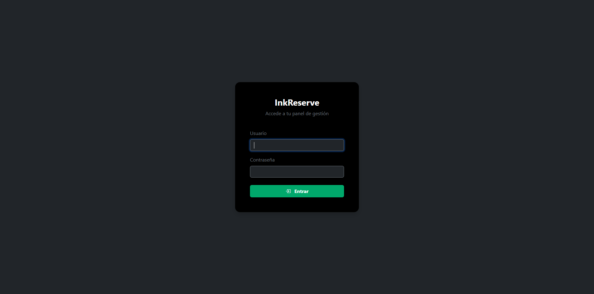
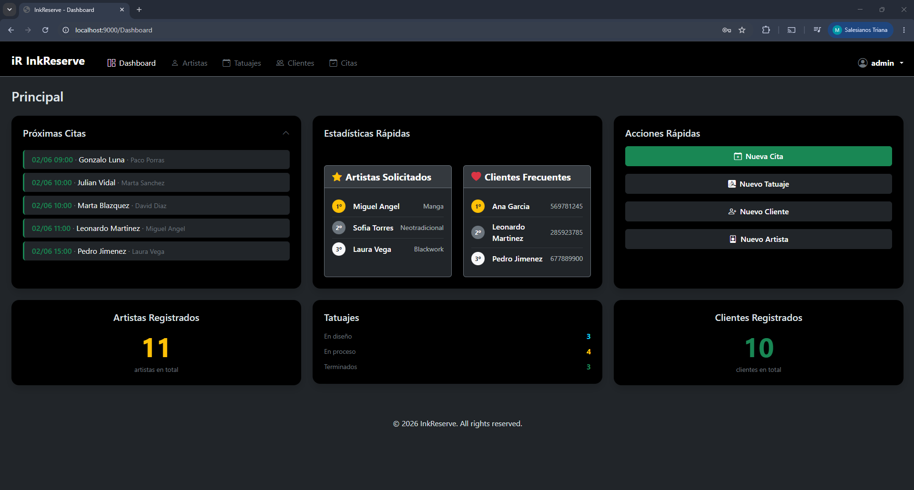
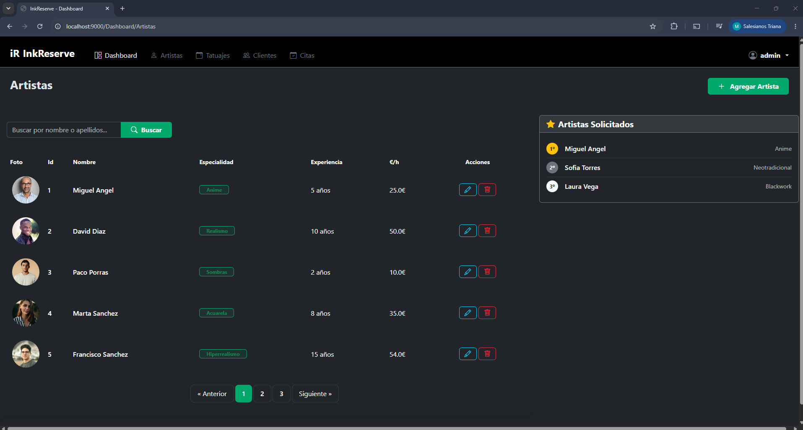
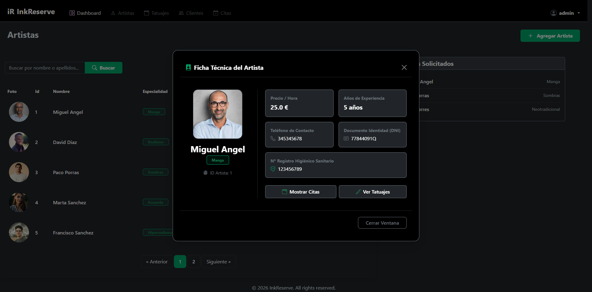
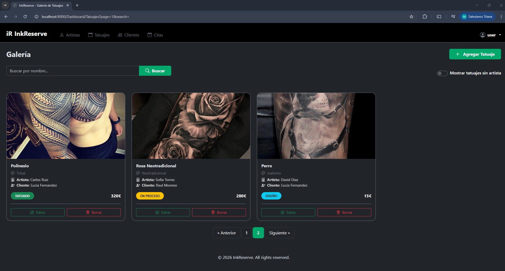
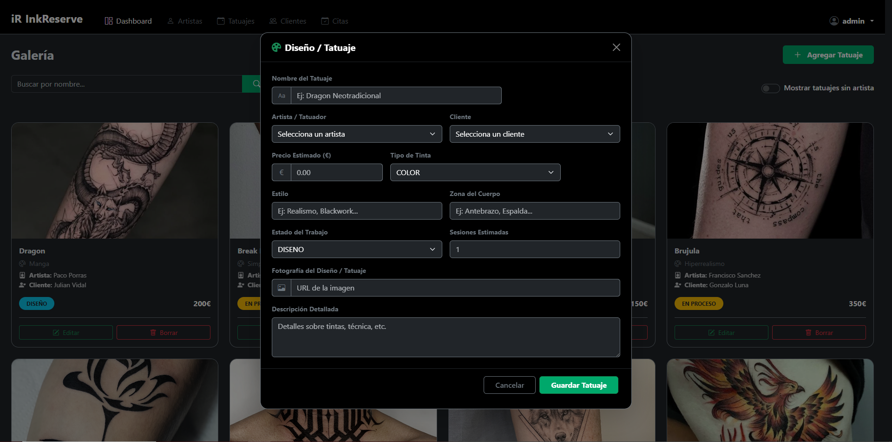
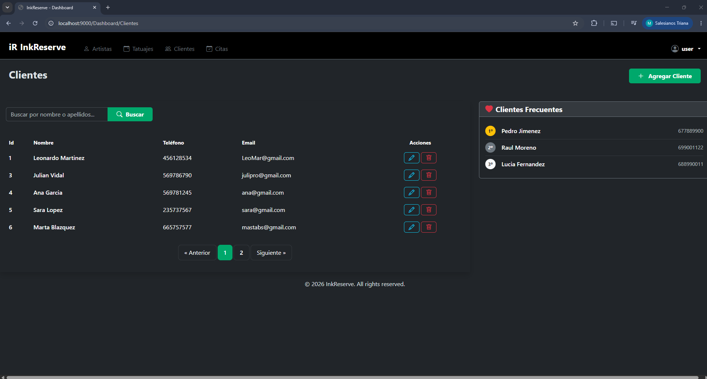
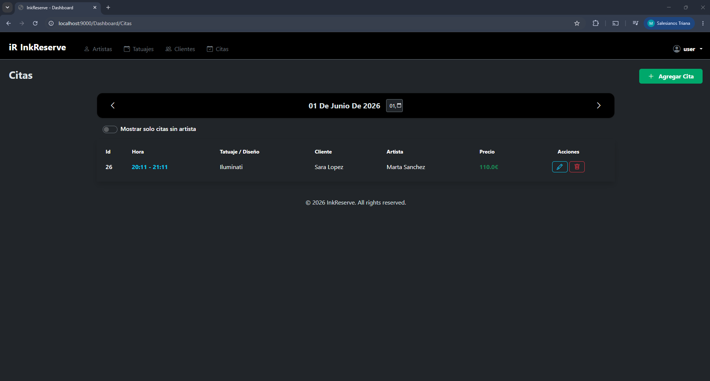
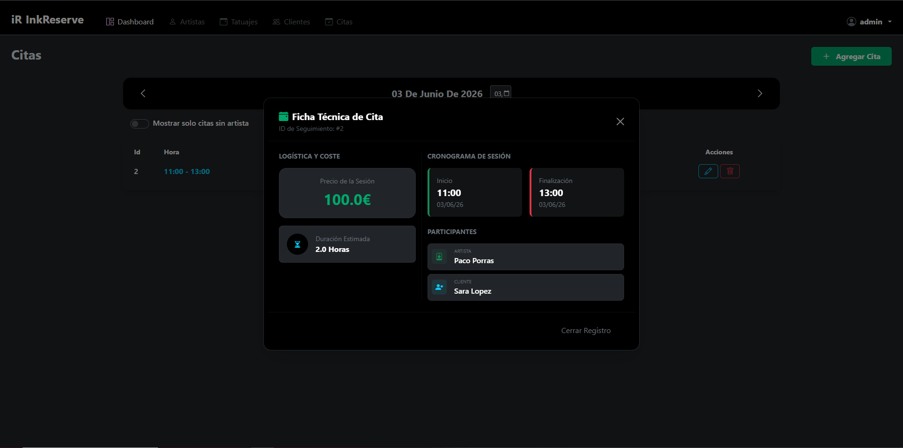

# iR InkReserve

es una aplicación web de gestión integral diseñada para estudios de tatuajes.
Desarrollada con Spring Boot y Thymeleaf, ofrece un panel de administración completo desde 
el que gestionar todos los aspectos del negocio: artistas, clientes, diseños y citas.

El sistema implementa un control de acceso por roles que distingue entre el administrador
del estudio (ADMIN) y los propios artistas (USER), cada uno con permisos adaptados a sus
necesidades. Los artistas disponen de su propio acceso con usuario y contraseña generados
automáticamente al ser registrados en el sistema.

La aplicación incluye validaciones de negocio como detección de solapamiento de citas,
campos únicos (DNI, teléfono, email), cálculo automático del precio por sesión y un
calendario semanal de disponibilidad por artista.

---

## Índice

1. [Descripción](#-inkreserve)
2. [Badges](#)
3. [Tecnologías utilizadas](#tecnologías-utilizadas)
4. [Requisitos previos](#requisitos-previos)
5. [Instalación y ejecución](#instalación-y-ejecución)
6. [Configuración](#configuración)
7. [Credenciales de acceso](#credenciales-de-acceso)
8. [Estructura del proyecto](#estructura-del-proyecto)
9. [Funcionalidades](#funcionalidades)
10. [Seguridad](#seguridad)
11. [Modelo de datos](#modelo-de-datos)
12. [Capturas de pantalla](#capturas-de-pantalla)
13. [Casos de prueba](#casos-de-prueba)
14. [Autor](#autor)
15. [Licencia](#licencia)

---

## Badges


---

## Tecnologías utilizadas

### Backend
| Tecnología | Versión | Uso |
|---|---|---|
| Java | 21 | Lenguaje principal |
| Spring Boot | 4.0.6 | Framework base |
| Spring MVC | - | Capa de controladores y vistas |
| Spring Security | - | Autenticación y autorización por roles |
| Spring Data JPA | - | Persistencia y acceso a datos |
| Hibernate | - | ORM |
| Lombok | - | Reducción de código boilerplate |
| Maven | 3.x | Gestión de dependencias y build |

### Frontend
| Tecnología | Versión | Uso |
|---|---|---|
| Thymeleaf | 3.x | Motor de plantillas HTML |
| Bootstrap | 5.3.2 | Framework CSS y componentes UI |
| Bootstrap Icons | 1.11.1 | Iconografía |
| JavaScript | ES6 | Interactividad del lado del cliente |

### Base de datos
| Tecnología | Versión | Uso |
|---|---|---|
| H2 | - | Base de datos en memoria para desarrollo |

### Herramientas
| Herramienta | Uso |
|---|---|
| Eclipse | IDE de desarrollo |
| Git + GitHub | Control de versiones |

---

## Requisitos previos

Antes de ejecutar el proyecto asegúrate de tener instalado lo siguiente:

| Herramienta | Versión mínima | Descarga |
|---|---|---|
| Java JDK | 21 | [oracle.com](https://www.oracle.com/java/technologies/javase/jdk21-archive-downloads.html) |
| Maven | 3.9+ | [maven.apache.org](https://maven.apache.org) |
| Git | Cualquiera | [git-scm.com](https://git-scm.com) |

> La base de datos **H2** es en memoria y se genera automáticamente al arrancar.
> No es necesario instalar ningún motor de base de datos externo.

---

```bash
java -version       # Debe mostrar Java 21 o superior
mvn -version        # Debe mostrar Maven 3.9 o superior
git --version       # Cualquier versión reciente
```

---

## Instalación y ejecución

### 1. Clonar el repositorio

```bash
git clone https://github.com/WakiTrapis/Repo_Proyecto_Final.git
cd Repo_Proyecto_Final/WorkSpace/ProyectoFinalInkReserve
```

### 2. Compilar el proyecto

```bash
mvn clean install
```

### 3. Ejecutar la aplicación

```bash
mvn spring-boot:run
```

### 4. Acceder a la aplicación

Una vez arrancada, abre el navegador y accede a:

http://localhost:9000

Serás redirigido automáticamente a la página de login.

### 5. Consola H2 (opcional)

http://localhost:9000/h2-console

| Campo |	Valor |
|---|---|
| JDBC URL |	jdbc:h2:mem:testdb |
| Usuario |	sa |
| Contraseña |	(vacío) |

---

## Configuración

La configuración principal se encuentra en `src/main/resources/application.properties`.

```properties
# Puerto del servidor (por defecto 9000)
server.port=9000

# Base de datos H2 en memoria
spring.datasource.url=jdbc:h2:mem:testdb;DB_CLOSE_ON_EXIT=FALSE
spring.datasource.username=sa
spring.datasource.password=

# JPA — recrea la base de datos en cada arranque
spring.jpa.hibernate.ddl-auto=create-drop
spring.jpa.show-sql=true

# Consola H2 habilitada
spring.h2.console.enabled=true
```

---

## Credenciales de acceso

### Usuarios del sistema

| Usuario | Contraseña | Rol |
|---|---|---|
| admin | admin | ADMIN |
| user | user | USER |

### Artistas (generados automáticamente al arrancar)

Los artistas del sistema tienen usuario creado automáticamente.
El **username** es su nombre y la **contraseña** es su DNI.

| Nombre | DNI (contraseña) | Especialidad |
|---|---|---|
| Miguel Angel | 77844091Q | Manga |
| David Diaz | 12786346H | Realismo |
| Paco Porras | 48692558F | Sombras |
| Marta Sanchez | 25678956G | Acuarela |
| Francisco Sanchez | 46213356D | Hiperrealismo |
| Pajaro Azul | 46216879D | Hiperrealismo |
| Laura Vega | 34567890K | Blackwork |
| Carlos Ruiz | 23456781L | Tribal |
| Sofia Torres | 12345679M | Neotradicional |
| Jorge Molina | 98765432N | Geométrico |

---

## Funcionalidades

### ADMIN — Acceso total al sistema

#### Dashboard Principal
- Visualización de próximas citas del día
- Top 3 artistas más demandados
- Top 3 clientes más frecuentes
- Acciones rápidas: nueva cita, nuevo tatuaje, nuevo cliente, nuevo artista

#### Gestión de Artistas
- Listar artistas con paginación y búsqueda por nombre
- Crear artista — genera automáticamente un usuario con rol USER
- Editar datos del artista
- Eliminar artista — desvincula sus tatuajes y elimina citas futuras
- Ver ficha técnica del artista con calendario semanal de disponibilidad y galería de tatuajes

#### Gestión de Clientes
- Listar clientes con paginación y búsqueda por nombre
- Crear, editar y eliminar clientes
- Al eliminar un cliente se eliminan sus tatuajes y citas asociadas
- Ver ficha del cliente con historial de citas y galería de tatuajes

#### Gestión de Citas
- Listar citas por día con navegación entre fechas
- Filtrar citas sin artista asignado
- Crear y editar citas con validaciones:
  - Fecha fin debe ser posterior a fecha inicio
  - La cita debe comenzar y terminar el mismo día
  - Detección de solapamiento de citas por artista
- Precio de sesión calculado automáticamente

#### Gestión de Tatuajes
- Galería de tatuajes con paginación y búsqueda
- Crear, editar y eliminar tatuajes
- Filtrar tatuajes sin artista asignado
- Estados: `DISEÑO` → `EN PROCESO` → `TATUADO`

---

### USER (Artista) — Acceso restringido

- Accede directamente al listado de artistas al iniciar sesión
- Puede **consultar** la ficha y calendario de cualquier artista
- Gestión completa de **clientes**, **citas** y **tatuajes**
- **No puede** crear, editar ni eliminar artistas
- **No puede** acceder al Dashboard principal
- Puede ver y editar su **perfil** con sus datos profesionales
- Puede **cambiar su contraseña** desde el Nav

---

### Funcionalidades comunes

- Navbar con dropdown de usuario mostrando foto de perfil
- Formularios en modales con validación frontend y backend
- Mensajes de error descriptivos sin perder los datos introducidos
- Confirmación antes de eliminar cualquier entidad
- Cierre de sesión desde cualquier página

---

## Seguridad

La seguridad de la aplicación está implementada con **Spring Security** y un sistema
de autenticación basado en roles.

### Roles

| Rol | Descripción |
|---|---|
| `ROLE_ADMIN` | Administrador del estudio. Acceso total. |
| `ROLE_USER` | Artista del estudio. Acceso restringido. |

### Autenticación

- Login en `/login` con formulario personalizado
- Logout en `/logout` con invalidación de sesión
- Contraseñas cifradas con `DelegatingPasswordEncoder`
- Redirección automática tras login según rol:
  - ADMIN → `/Dashboard`
  - USER → `/Dashboard/Artistas`

### Autorización

| Recurso | ADMIN | USER |
|---|---|---|
| `/Dashboard` | ✅ | ❌ |
| `/Dashboard/**` (GET) | ✅ | ✅ |
| Crear / editar / eliminar artistas | ✅ | ❌ |
| Crear / editar clientes, citas, tatuajes | ✅ | ✅ |
| `/perfil` | ✅ | ✅ |
| `/cambiar-contrasena` | ✅ | ✅ |

### Gestión de usuarios de artistas

Al crear un artista desde el panel de administración, el sistema genera
automáticamente un usuario vinculado con:
- **Username** → nombre del artista
- **Password** → DNI del artista (cifrado)
- **Rol** → `ROLE_USER`

Al eliminar un artista, su usuario asociado se elimina en cascada.

### Páginas de error

| Situación | Página |
|---|---|
| Acceso sin permisos | `/acceso-denegado` |
| Credenciales incorrectas | `/login?error` |
| Logout completado | `/login?logout` |

---


### Descripción de entidades

#### Artista

| Campo | Tipo | Restricciones |
|---|---|---|
| id | Long | PK, auto |
| nombreArtista | String | NotBlank |
| especialidad | String | - |
| precioHora | Double | NotNull, min 10.0 |
| dniArtista | String | NotBlank, único, patrón 8N+1L |
| telefonoArtista | String | NotBlank, 9 dígitos, único |
| numeroHigienico | String | - |
| experiencia | Integer | min 0 |
| fotoArtista | String | URL |

#### Cliente

| Campo | Tipo | Restricciones |
|---|---|---|
| id | Long | PK, auto |
| nombreCliente | String | NotBlank |
| telefonoCliente | String | único |
| fechaNacimiento | LocalDate | - |
| direccion | String | - |
| codigoPostal | String | - |
| poblacion | String | - |
| dniCliente | String | único, patrón 8N+1L |
| email | String | único |

#### Tatuaje

| Campo | Tipo | Restricciones |
|---|---|---|
| id | Long | PK, auto |
| nombreTatuaje | String | - |
| descripcionTatuaje | String | - |
| estiloTatuaje | String | - |
| zonaCuerpoTatuaje | String | - |
| imagenTatuaje | String | URL |
| sesionesTatuaje | Integer | - |
| precioTatuaje | Double | - |
| tipoTintaTatuaje | Enum | COLOR / BLACK |
| estado | Enum | DISENO / EN_PROCESO / TATUADO |
| artista | Artista | ManyToOne |
| cliente | Cliente | ManyToOne |

#### Cita

| Campo | Tipo | Restricciones |
|---|---|---|
| id | Long | PK, auto |
| fechaInicio | LocalDateTime | mismo día que fechaFinal |
| fechaFinal | LocalDateTime | posterior a fechaInicio |
| duracion | Double | - |
| precioSesion | Double | calculado automáticamente |
| artista | Artista | ManyToOne |
| cliente | Cliente | ManyToOne |
| tatuaje | Tatuaje | ManyToOne |

#### User

| Campo | Tipo | Restricciones |
|---|---|---|
| id | Long | PK, auto |
| username | String | único |
| password | String | cifrada |
| userRol | Enum | ADMIN / USER |
| artista | Artista | OneToOne |

---

## Capturas de pantalla

### Login


### Dashboard Principal (ADMIN)


### Listado de Artistas


### Ficha del Artista


### Dashboard Tatuajes


### Formulario Tatuajes


### Dashboard Clientes


### Dashboard Citas


### Ficha Cita


---

## Casos de prueba

La aplicación ha sido sometida a pruebas manuales no automatizadas que cubren
los flujos principales de la aplicación.

El documento completo de casos de prueba se encuentra en:

📄 [`docs/CasosPrueba_InkReserve(1).pdf`](docs/CasosPrueba_InkReserve(1).pdf)

### Resumen

| Categoría | Nº de casos | Resultado |
|---|---|---|
| Autenticación | 5 | ✅ |
| Gestión de Artistas | 7 | ✅ |
| Gestión de Clientes | 6 | ✅ |
| Gestión de Citas | 5 | ✅ |
| Gestión de Tatuajes | 3 | ✅ |
| Perfil y contraseña | 5 | ✅ |
| **Total** | **31** | **✅** |

### Errores detectados y corregidos

| ID | Descripción | Gravedad | Estado |
|---|---|---|---|
| ERR-001 | Artistas con DNI duplicado | Alta | ✅ Corregido |
| ERR-002 | Artistas con teléfono duplicado | Alta | ✅ Corregido |
| ERR-003 | Clientes con DNI duplicado | Alta | ✅ Corregido |
| ERR-004 | Cita con fecha fin anterior a inicio | Alta | ✅ Corregido |
| ERR-005 | Cita en días distintos | Media | ✅ Corregido |
| ERR-006 | Solapamiento de citas del mismo artista | Alta | ✅ Corregido |
| ERR-007 | USER accedía al Dashboard principal | Alta | ✅ Corregido |

---

## Autor

**Miguel Ángel Blázquez Sánchez**
- 📧 [blazquezdesarrollo@gmail.com](mailto:blazquez.samig25@triana.salesianos.edu)
- 🐙 [github.com/WakiTrapis](https://github.com/WakiTrapis)

---

## Licencia

Este proyecto ha sido desarrollado con fines exclusivamente educativos
como Proyecto Final del primer curso del ciclo formativo de **Desarrollo de Aplicaciones Multiplataforma (DAM)**
en el centro **Salesianos Triana**.

No está permitida su distribución ni uso comercial.


